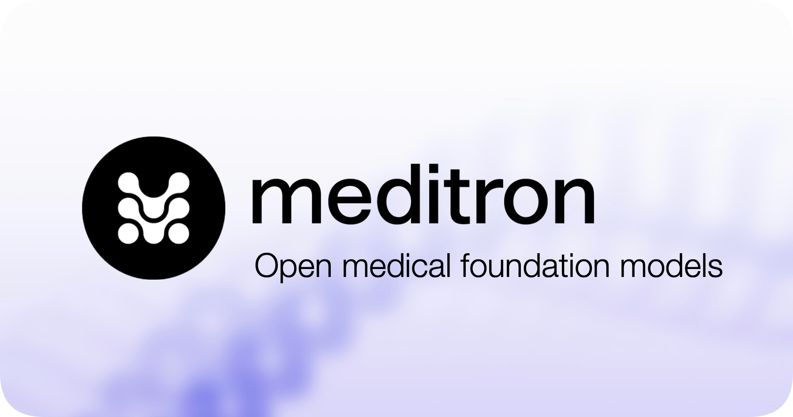

## 💡 Hi there!

I'm Antoine Bonnet, a research scientist intern at Meta and Master's student at EPFL at the [NLP](https://nlp.epfl.ch) lab.

### Latest projects

🧬 **[Moove](https://jointhemoove.org)**: a collaborative platform where doctors can share their expertise to evaluate and align AI with real-world medical standards. 

🧪  **Meditron**: a suite of open-source medical foundation large language models (LLMs). Weights are accessible for [Meditron-70B](https://huggingface.co/epfl-llm/meditron-70b) and [Meditron-7B](https://huggingface.co/epfl-llm/meditron-7b) on Huggingface. 

- 📚 **Meta AI blog**: [Meditron: An LLM suite especially suited for low-resource medical settings leveraging Meta Llama
](https://ai.meta.com/blog/llama-2-3-meditron-yale-medicine-epfl-open-source-llm/)

- 🦾 **Repo**: [epfLLM/meditron](https://github.com/epfLLM/meditron)

- 📖 **Pre-print**: [MEDITRON-70B: Scaling Medical Pre-Training For Large Language Models](https://arxiv.org/abs/2311.16079)

- 🗞️ **Press Release**: [EPFL's new Large Language Model for Medical Knowledge](https://actu.epfl.ch/news/epfl-s-new-large-language-model-for-medical-knowle/)

- 🧬 **Open-source dataset**: [Clinical Guidelines Corpus](https://huggingface.co/datasets/epfl-llm/guidelines)

### 🎓 Education

- 🇨🇭 MSc in Computer Science \@ EPFL, Swiss Federal Institute of Technology
- 🇨🇦 BSc Honours in Computer Science and Mathematics \@ McGill University 

[Download my resume](CV.pdf)
