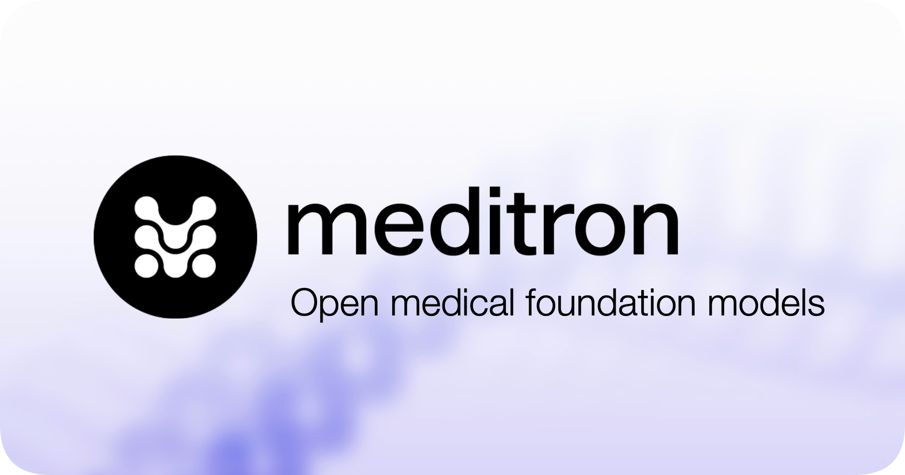

# 👋 Hi there! I'm Antoine Bonnet

 <!-- This line adds the image as an emoji -->

I'm a Natural Language Processing (NLP) researcher in the [EPFL LLM team](https://huggingface.co/epfl-llm) collaborating with the [NLP](https://nlp.epfl.ch) and [MLO](https://www.epfl.ch/labs/mlo/) labs at EPFL.

With a team of 30 EPFL researchers, we proudly present **MEDITRON**, the world's best open-source Large Language Model. 🌐 We've publicly released the weights for [Meditron-70B](https://huggingface.co/epfl-llm/meditron-70b) and [Meditron-7B](https://huggingface.co/epfl-llm/meditron-7b).

- 🦾 **GitHub Repo**: [epfLLM/meditron](https://github.com/epfLLM/meditron)

- 📖 **Paper** (pre-print): [MEDITRON-70B: Scaling Medical Pre-Training For Large Language Models](https://arxiv.org/abs/2311.16079)

- 📢 [**Announcement**](https://www.linkedin.com/feed/update/urn:li:activity:7135408165017243648/)

- 🗞️ [**Press Release**](https://actu.epfl.ch/news/epfl-s-new-large-language-model-for-medical-knowle/)

## 🎓 Education

- MSc in Computer Science \@ EPFL, Swiss Federal Institute of Technology
- BSc Honours in Computer Science and Mathematics \@ McGill University 
